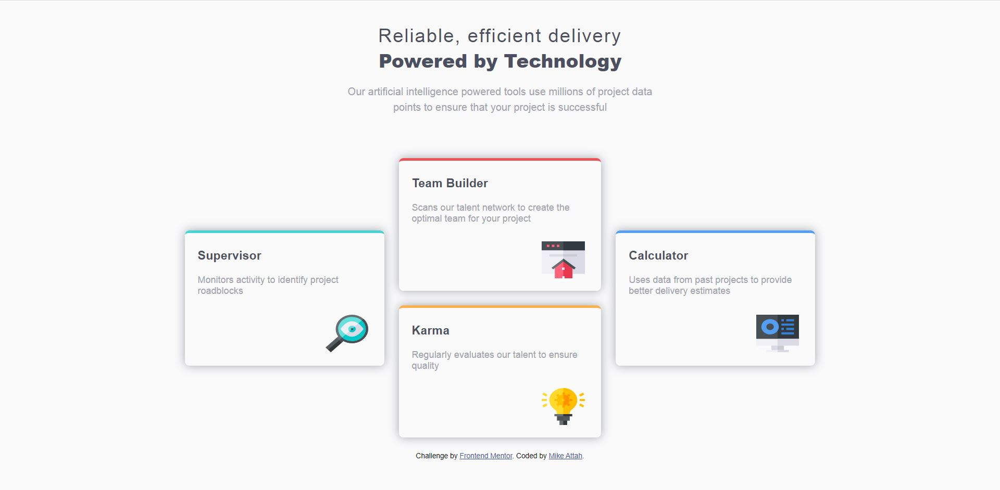

# Frontend Mentor - Four card feature section solution

This is a solution to the [Four card feature section challenge on Frontend Mentor](https://www.frontendmentor.io/challenges/four-card-feature-section-weK1eFYK). Frontend Mentor challenges help you improve your coding skills by building realistic projects.

## Table of contents

- [Overview](#overview)
  - [The challenge](#the-challenge)
  - [Screenshot](#screenshot)
  - [Links](#links)
- [My process](#my-process)
  - [Built with](#built-with)
  - [Continued development](#continued-development)
- [Author](#author)

## Overview

### The challenge

Users should be able to:

- View the optimal layout for the site depending on their device's screen size

### Screenshot

### Links

- Solution URL: [Frontend Mentor](https://www.frontendmentor.io/solutions/responsive-web-design-using-html5-css-incl-css-grid-paIiBgqVg)
- Live Site URL: [GitHub Pages](https://mikeattah.github.io/four-card-feature-section/)

## My process

### Built with

- Semantic HTML5 markup
- CSS custom properties
- Flexbox
- CSS Grid
- Mobile-first workflow

### Continued development

I will continue to learn more about CSS Grid as I am more comfortable working with Flexbox for layout.

## Author

- Website - [Mike Attah](https://mikeattah.com)
- Frontend Mentor - [@mikeattah](https://www.frontendmentor.io/profile/mikeattah)
- Twitter - [@miikeattah](https://www.twitter.com/miikeattah)
